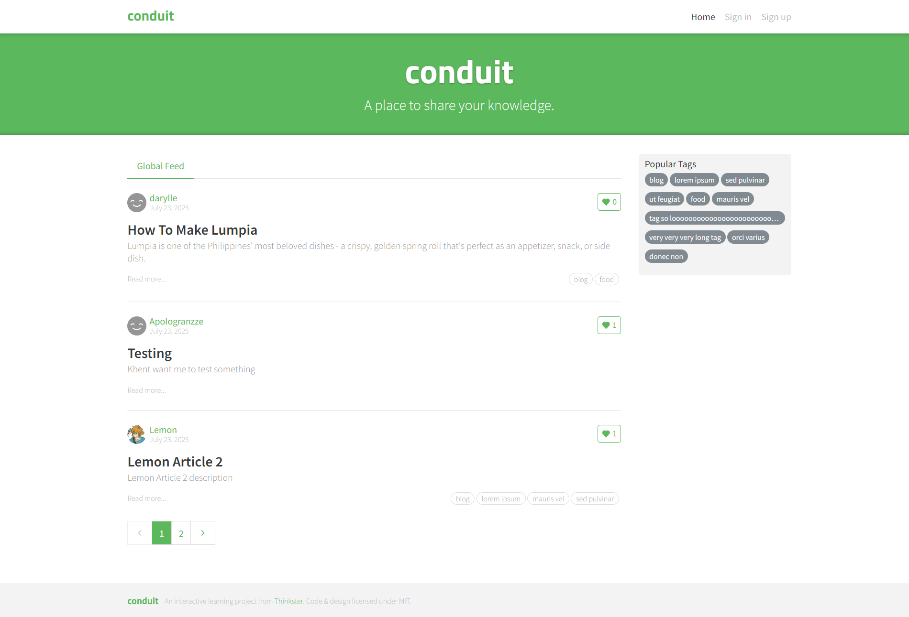
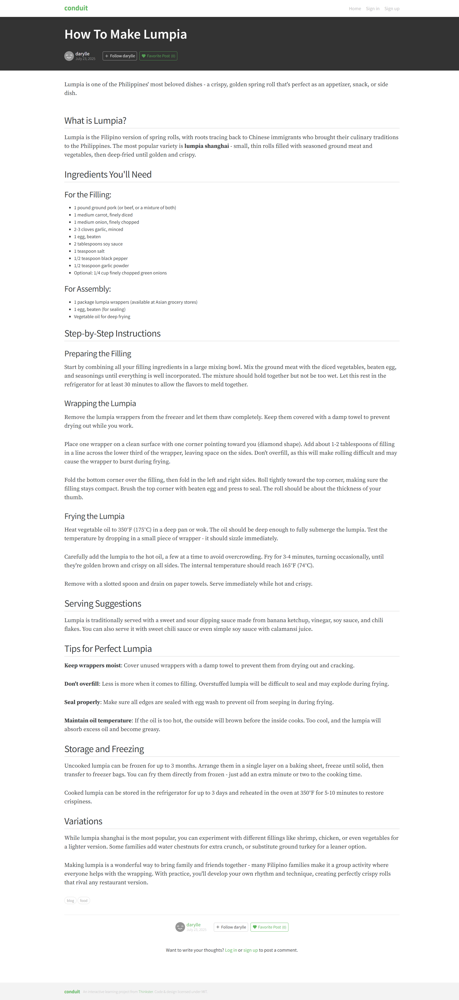

# 

# Conduit - React + Vite + Tailwind Codebase

> ### React + Vite + Tailwind codebase containing real world examples (CRUD, auth, advanced patterns, etc) that adheres to the [RealWorld](https://github.com/gothinkster/realworld) spec and API.

### [Demo](https://conduit-frontend-six.vercel.app/)&nbsp;&nbsp;&nbsp;&nbsp;[RealWorld](https://github.com/gothinkster/realworld)

This codebase was created to demonstrate a fully fledged fullstack application built with **React, Vite, TypeScript, Tailwind CSS, and shadcn/ui** including CRUD operations, authentication, routing, pagination, and more.

## Screenshots





## Tech Stack

-   **Framework:** [React](https://react.dev/) (with [Vite](https://vitejs.dev/))
-   **Language:** [TypeScript](https://www.typescriptlang.org/)
-   **Styling:** [Tailwind CSS](https://tailwindcss.com/) & [shadcn/ui](https://ui.shadcn.com/)
-   **State Management:** [Zustand](https://zustand-demo.pmnd.rs/) (Client state) & [TanStack Query](https://tanstack.com/query/latest) (Server state)
-   **Routing:** [React Router v7](https://reactrouter.com/)
-   **Forms:** [React Hook Form](https://react-hook-form.com/) & [Zod](https://zod.dev/)
-   **Rich Text Editor:** [Lexical](https://lexical.dev/)
-   **HTTP Client:** [Axios](https://axios-http.com/)

## Features

-   **Authentication:** Login, Register, JWT handling.
-   **Articles:** Create, Read, Update, Delete (CRUD) articles.
-   **Rich Text Editor:** Custom Lexical-based editor for writing articles.
-   **Comments:** Comment on articles.
-   **Social:** Follow users, favorite articles.
-   **Tags:** Filter articles by tags.
-   **Profile:** User profile pages with their articles and favorites.
-   **Responsive Design:** Mobile-friendly UI using Tailwind.

## Backend

This frontend application is built to consume the API provided by the [Django Rest Framework Backend](https://github.com/Lemon1903/conduit-backend). Please refer to that repository for backend setup and API documentation.

## Getting Started

### Prerequisites

-   Node.js (Latest LTS recommended)
-   npm, yarn, or pnpm

### Installation

1.  Clone the repository.
2.  Navigate to the frontend project directory:
    ```bash
    cd frontend
    ```
3.  Install dependencies:
    ```bash
    npm install
    ```

### Environment Setup

1.  Create a `.env` file in the `frontend` directory.
2.  Set the API URL (defaults to localhost if not set, but good practice to define):
    ```env
    VITE_API_URL=http://localhost:8000/api
    ```

### Running the App

Start the development server:

```bash
npm run dev
```

The application will be available at `http://localhost:5173`.

### Building for Production

To build the application for production:

```bash
npm run build
```

To preview the production build:

```bash
npm run preview
```

## Project Structure

The source code is located in `frontend/src`:

-   `components`: Reusable UI components (including shadcn/ui primitives).
-   `hooks`: Custom React hooks (React Query mutations, local storage, etc.).
-   `layouts`: Layout wrappers (Main, Home, Profile, etc.).
-   `lib`: Utilities, API client configuration, auth helpers.
-   `pages`: Route components (Login, Editor, ArticleDetails, etc.).
-   `schemas`: Zod validation schemas.
-   `stores`: Zustand stores (User, Page persistence).
-   `types`: TypeScript interface definitions.

## License

MIT